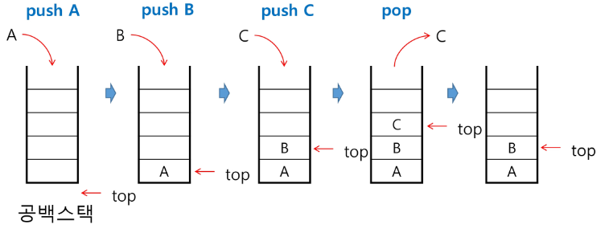

# Stack
## 스택의 특성
* 물건을 쌓아 올리듯 자료를 쌓아 올린 형태의 자료 구조
* 스택에 저장된 자료는 선형 구조
    - 선형구조 : 자료간의 관계가 1대1의 관계를 갖는다.
    - 비선형구조 : 자료간의 관계가 1대N의 관계를 갖는다.
* 스택에 자료를 삽입하거나 스택에서 자료를 꺼낼 수 있다.
* 마지막에 삽입한 자료를 가장 먼저 꺼낸다. 후입선출(LIFO, Last-In-First-Out)

## 스택의 구현
* 스택을 프로그램에서 구현하기 위해서 필요한 자료 구조와 연산
* 자료구조 : 자료를 선형으로 저장할 저장소
    - 스택에서 마지막 삽입된 원소의 위치를 top이라고 부른다.
    - 연산 :
        - 삽입 : 저장소에 자료를 저장, 보통 push라고 부름
        - 삭제 : 저장소에 자료를 꺼냄. 꺼낸 자료는 삽입한 자료의 역순으로 꺼냄. 보통 pop이라고 부름
        - 스택이 공백인지 아닌지를 확인하는 연산 isEmpty
        - 스택의 top에 있는 item(원소)를 반환하는 연산 peek

## 스택의 삽입/삭제 과정
* 빈 스택에 원소 A,B,C를 차례로 삽입 후 한번 삭제하는 연산과정


### 스택의 push 알고리즘
* append 메소드를 통해 리스트의 마지막에 데이터를 삽입
초기에 top은 -1로 설정하여 리스트에 추가 될때마다 top의 값이 하나씩 증가함.
### 스택의 구현
#### push
```py
def push(item):
    s.append(item)
    # 이방법은 리스트의 길이에 상관없이 끝에 값을 추가하지만 리스트가 길이가 길어지면 속도가 느려짐
```

```py
def push(item,size):# 속도를 빠르게 접근하기 위해 인덱스로 접근 인덱스 접근은 빠르게 접근이 가능함
    global top
    top += 1
    if top ==size:# isfull함수로 구현
        print('overflow!')
    else:
        stack[top] = item
size =10
stack = [0]* size
top = -1

push(10,size)
top +=1 # push(20)
stack[top]=20 
```
#### pop
```py
def pop():
    if len(s)==0:
        # underflow
        return
    else:
        return s.pop()
```
```py
def pop():
    global top
    if top == -1:
        print('underflow')
        return 0
    else:
        top -=1
        return stack[top+1]
print(pop())

if top>-1: # pop()
    top -=1
    print(stack[top+1])

```

## 스택 구현시 고려사항
* 1차원 배열을 사용하여 구현할 경우 구현이 용이하다는 장점이 있지만 스택의 크기를 변경하기가 어렵다는 단점이 있다.
* 이를 해결하기 위한 방법으로 저장소를 동적으로 할당하여 스택을 구현하는 방법이 있다. 동적 연결리스트를 이용하는 구현하는 방법을 의미
 = 구현은 복잡하지만 메모리를 효율적으로 사용할 수 있음
 ** 스택의 동적 구현에 대한 학습 필요

## 스택의 응용
* 스택은 괄호 검사에 사용할 수 있음
  

* Function call
    - 프로그램에서의 함수 호출과 복귀에 따른 수행 순서를 관리<br>
    가장 마지막에 호출된 함수가 가장 먼저 실행을 완료하고 복귀하는 후입선출 구조이므로, 후입선출 구조의 스택을 이용하여 수행 순서 관리
    - 함수 호출이 발생하면 호출한 함수 수행에 필요한 지역변수, 매개변수 및 수행후 복귀할 주소 등의 정보를 스택 프레임에 저장하여 시스템 스택에 삽입
    - 함수의 실행이 끝나면 시스템 스택의 top 원소(스택 프레임)을 삭제(pop)하면서 프레임에 저장되어있던 복귀 주소를 확인하고 복귀
    - 함수 호출과 복귀에 따라 이과정을 반복하여 전체 프로그램 수행이 종료되면 시스템 스택은 공백 스택이 된다.
  


# Memoization
## 재귀호출
* 필요한 함수가 자신과 같은 경우 자신을 다시 호출하는 구조
* 함수에서 실행해야 하는 작업의 특성에 따라 일반적인 호출방식보다 재귀호출 방식을 사용하여 함수를 만들면 프로그램의 크기를 줄이고 간단하게 작성
* 피보나치처럼 재귀함수 구현의 문제점은 엄청난 중복 호출을 진행
* 재귀함수를 짜기 전에 패턴의 단순화를 먼저 진행해야함.

## Memoization
* 컴퓨터 프로그램을 실행할 때 이전에 계산한 값을 메모리에 저장해서 매번 다시 계산하지 않도록 하여 전체적인 실행 속도를 빠르게 하는 기술
=> 동적계획법(Dynamic Programming)의 핵심 기술
* Memoization은 글자 그대로 해석하면 '메모리에 넣기'라는 의미, 기억되어야할 것 이라는 뜻의 라틴어 memorandum에서 파생
* 이 방법을 사용하면 피보나치 수 알고리즘에서 실행시간을 O(n)으로 줄일 수 있음.
* Memoiztion 방법을 적용한 피보나치 알고리즘
```py
# memo를 위한 배열을 할당하고, 모두 0으로 초기화한다.
# memo[0]을 0으로 memo[1]는 1로 초기화한다.

def fibo1(n):
    global memo
    if n>=2 and memo[n]==0:
        memo[n] = fibo1(n-1) + fibo1(n-2)
    return memo[n]

memo = [0]*(n+1)
memo[0] = 0
memo[1] = 1
```