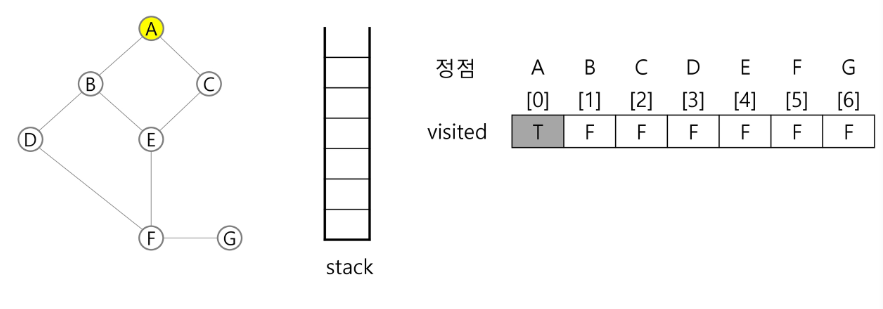
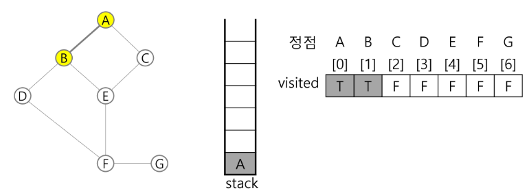
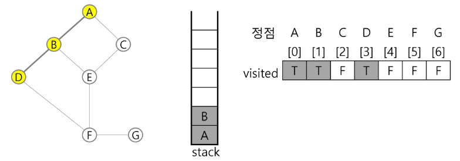
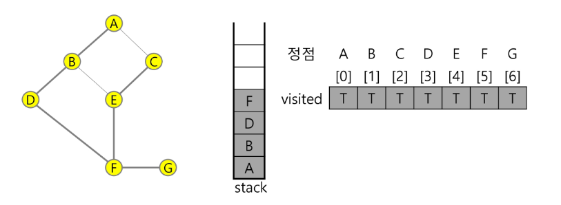

# DP
* 동적계획 알고리즘은 그리디 알고리즘과 같이 최적화 문제를 해결하는 알고리즘
* 동적계획 알고리즘은 먼저 입력크기가 작은 부분 문제들을 모두 해결한 후에 그 해들을 이용하여 보다 큰 크기의 부분 문제들을 해결하여, 최종적으로 원래 주어진 입력의 문제 해결

## 피보나치 수 DP 적용
* 피보나치 수는 부분 문제의 답으로부터 본 문제의 답을 얻을 수 있으므로 최적 부분 구조로 이루어져 있음
1) 문제를 부분으로 분할(f(n)=f(n-1) + f(n-2), f(n-1)=f(n-2)+f(n-3))
2) 부분 문제로 나누는 일을 끝냈으면 가장 작은 부분 문제부터 해를 구한다
3) 그 결과를 테이블에 저장하고, 테이블에 저장된 부분 문제의 해를 이용하여 상위 문제의 해를 구한다.
* memoization을 재귀적 구조에 사용하는 것보다 반복적 구조로 DP를 구현하는 것이 성능면에서 효율적이다.
* 재귀적 구조는 내부에 시스템 호출 스택을 사용하는 오버헤드가 발생하기 때문

# DFS(깊이 우선 탐색)
* 비선형 구조(노드가 여러개랑 연결되어 얽혀있는 구조)인 그래프 구조는 그래프로 표현된 모든 자료를 빠짐없이 검색하는 것이 중요
* 시작 정점(node, vertax)의 한방향으로 갈 수 있는 경로가 있는 곳까지 깊이 탐색해 가다가 더 이상 갈 곳이 없게 되면, 가장 마지막에 만났던 갈림길 간선(edge)이 있는 정점으로 되돌아와서 다른 방향의 정점으로 탐색을 계속 반복하여 결국 모든 정점을 방문하는 순회방법
* 가장 마지막에 만났던 갈림길의 정점으로 되돌아가서 다시 깊이 우선 탐색을 반복해야 하는 후입선출 구조의 스택 사용

## DFS 알고리즘
* DFS 알고리즘의 중요한 점은 방문한 곳을 표시하는 것
1) 시작 정점 v를 결정하여 방문한다.
2) 정점 v에 인접한 정점 중에서
    1) 방문하지 않은 정점 w가 있으면, 정점 v를 스택에 push하고 정점 w를 방문한다. 그리고 w를 v로 하여 다시 2)를 반복한다.(방문 표시를 해줘서 나중에 다시 갈림길이 있는곳으로 되돌아감)
    2) 방문하지 않은 정점이 없으면, 탐색 방향을 바꾸기 위해서 스택을 pop하여 받은 가장 마지막 방문 정점을 v로 하여 다시 2)를 반복한다.
3) 스택이 공백이 될때까지 2)를 반복한다.

```
# DFS 슈도 코드
visited[],stack[] 초기화
DFS(v)
    시작점 v 방문;
    visited[v] <- true;
    while {
        if ( v의 인접 정점 중 방문 안 한 정점 w가 있으면)
            push(v);
            v <- w; (w에 방문)
            visited[w] <- true;
        else:
            if (스택이 비어있지 않으면)
                v <- pop(stack);
            else
                break
    }
end DFS()
```

### DFS 예시
* 초기 상태 : 배열 visited를 False로 초기화하고, 공백 스택을 생성
  

* 서로 이동이 가능한 노드를 표현 하기 위해 이차원 배열로 받아올 수 있음<br>
row는 출발지, col은 도착지
A - B, A-C인경우

||A|B|C|
|--|--|--|--|
|A|0|1|1|
|B|1|0|0|
|C|1|0|0|
* 아니면 리스트로 받아와서 저장 가능

```py
# 7 8 노드수, 간선수
# 1 2 1 3 2 4 2 5 4 6 5 6 6 7 3 7

# 주로 인풋은 간선, 정점 정보를 같이줌
# 인접 배열을 저장할 때는 간선의 정보를 이용해서 저장하면 됨
# 인접 배열을 초기화할 때는 정점 정보를 이용하면 됨
input = '1 2 1 3 2 4 2 5 4 6 5 6 6 7 3 7'
V,E =7,8
edge_list = list(map(int,input.split()))
# 0은 연결되어 있지 않음을 의미, 1로 바꾸면 연결되어 있음을 뜻함

adj_arr = [[0]*(V+1) for _ in range(V+1)] # 정점의 개수 만큼 2차원 리스트 형성
# 0번인덱스를 안쓰고 정점의 번호를 그대로 저장하기 위해 +1을 해줌
for idx in range(E):
    # 시작점(idx*2) 도착점(idx*2 +1)
    start = edge_list[idx*2]
    end = edge_list[idx*2+1]
    adj_arr[start][end] = 1


# list로 노드,엣지 저장
# 정점 번호를 그대로 index로 사용하기 위해 +1을 해줌
adj_list = [[]for _ in range(V+1)]

for idx in range(E):
    start = edge_list[idx * 2]
    end = edge_list[idx * 2 + 1]

    adj_list[start].append(end)
    # 만약 양뱡향으로 저장해야 하는 경우
    # adj_list[end].append(start)
```


1) 정점 A를 시작으로 깊이 우선 탐색을 시작
```
A 방문;
visited[A] <-true;
```

방문한 후에는 stack에 쌓아서 나중에 되돌아 올 수 있도록 만들어줌

2) 정점 A에 방문하지 않은 정점 B,C가 있으므로 A를 스택에 push하고, 인접정점 B와 C 중에서 오름차순에 따라 B를 선택하여 탐색을 계속한다.
```
push(A);
B(방문);
visited[b]<- true;
```


3) 정점 B에 방문하지 않은 정점 D,E가 있으므로 B를 스택에 push하고, 인접정점 D와 E 중에서 오름차순에 따라 D를 선택하여 탐색을 계속한다.
```
push(B);
D 방문;
visited[D] <-true;
```

4) 정점 D에 방문하지 않은 정점 F가 있으므로 D를 스택에 push하고, 인접정점F를 선택하여 탐색을 계속<br>
5) 정점 F에 방문하지 않은 정점 E,G가 있으므로 F를 스택에 push하고, 인접정점 E와 G 중에서 오름차순에 따라 E를 선택하여 탐색을 계속한다.<br>
6) 정점 E에 방문하지 않은 정점 C가 있으므로 E를 스택에 push하고, 인접정점 C를 선택하여 탐색을 계속한다.<br>
7) 정점 C에서 방문하지 않은 인접정점이 없으므로, 마지막 정점으로 돌아가기 위해 스택을 pop하여 받은 정점 E에 대해서 방문하지 않은 인접정점이 있는지 확인한다.<br>
8) 정점 E는 방문하지 않은 인접 정점이 없으므로, 다시 스택을 pop하여 받은 정점 F에 대해서 방문하지 않은 인접정점이 있는지 확인한다.


9) 정점 F에 방문하지 않은 정점 G가 있으므로 F를 스택에 push하고, 인접정점 G를 선택하여 탐색을 계속한다.<br>

10) 정점 G에서 방문하지 않은 인접정점이 없으므로, 마지막 정점으로 돌아가기 위해 스택을 pop하여 받은 정점 F에 대해서 방문하지 않은 인접정점이 있는지 확인한다. D B A 반복
12) 현재 정점 A에서 방문하지 않은 인접 정점이 없으므로 마지막 정점으로 돌아가기 위해 스택을 pop하는데, 스택이 공백이므로 깊이 우선 탐색을 종료한다.


```py
'''
input
7 8 # 노드 수, 엣지수
1 2 1 3 2 4 2 5 4 6 5 6 6 7 3 7 # 두개의 연결된 노드들의 배열 1,2가연결 1,3연결 이런식으로
'''

V, E = map(int,input().split())
arr = list(map(int,input().split()))
adjl = [[] for _ in range(V+1)] # ardjl[i]행에 i에 인접인 정점번호
for _ in range(E):
    n1,n2 = i*2, i*2+1
    adjl[n1].append(n2)
    adjl[n2].append(n1) # 방향이 없는경우
#[[],[2,3],[1,4,5],[1,7]....]
```


```py
def dfs(i,V): # 시작 i,마지막 V
    # visited, stack 생성 및 초기화
    visited = [0]*(V+1) 
    st= []
    visited[i] =1 # 시작점 방문 
    print(i)# 정점에서 할일
    while True: # 탐색
        for w in adjl[i]:# 현재 방문한 정점에서 인접하고 방문 안한 정점w가 있으면 
            if visited[w]==0:
                st.append(i) # push i, i를 지나서
                i=w # w에 방문
                visited[w]=1
                print(w)
                break
        else: # i에 남은 인접 정점이 없으면
            if st: # 스택이 비어 있지 않을경우(지나온 정점이 남아 있으면)
                i = st.pop()
            else: # 스택이 비어 있으면
                break
    return

dfs(1,V)


```

```py
def dfs(i):
    visited[i] = 1  # 방문 표시
    print(i)
    # i에 인접하고 방문안한 w가 있으면
    for w in adjl[i]:
        if visited[w] == 0:
            dfs(w)
#     visited = [0] * (100)
def dfs(i):
    st = []
    visited[i] = 1
    print(i)
    while True:
        for w in adjl[i]:
            if visited[w] == 0:
                st.append(i)
                i = w
                visited[i] =1
                print(i)
                break
        else:
            if st:
                i = st.pop()
            else:
                break
    return
V,E = map(int,input().split())
arr = list(map(int, input().split()))
adjl = [[] for _ in range(100)]
visited = [0] * (100)
for i in range(E):
    n1, n2 = arr[i*2], arr[i*2+1]
    adjl[n1].append(n2)
    adjl[n2].append(n1)
dfs(1)
```