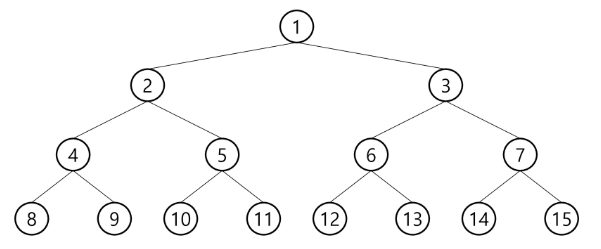
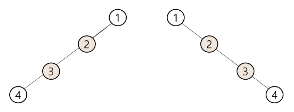
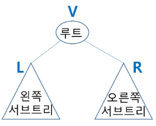

# 트리
## 트리의 개념
* 비선형 구조
* 원소들 간에 1:n관계를 가지는 자료구조
* 원소들 간에 계층관계를 가지는 계층형 자료구조
* 상위 원소에서 하위 원소로 내려가면서 확장되는 트리 모양의 구조

* 한 개이상의 노드로 이루어진 유한 집합
    - 노드 중 최상위 노드는 루트(root)
    - 나머지 노드들은 n개의 분리 집합으로 분리될수 있음
* 트리는 각각의 부트리로 구성되어 있음


## 용어정리
* 노드 - 트리의 원소
    - 트리 T의 노드 : A,B,C,D,E,F,G,H,I,J,K
* 간선 - 노드를 연결하는 선. 부모와 자식 노드를 연결
* 루트 노드-트리의 시작노드
    - 트리 T의 루트 노드 - A
* 형제 노드 - 같은 부모 노드의 자식 노드들
    - B,C,D는 형제 노드
* 조상 노드 - 간선을 따라 루트 노드까지 이르느 경로에 있는 모든 노드들
    - K의 조상 노드 : F,B,A
* 서브 트리 - 부모 노드와 연결된 간선을 끊었을 때 생성되는 트리
* 자손 노드 - 서브 트리에 있는 하위 레벨의 노드들
    - B의 자손 노드 - E,F,K

* 차수(degree)
    * 노드의 차수 : 노드에 연결된 자식 노드의 수.
       - B의 차수 = 2, C의 차수 = 1
    * 트리의 차수 : 트리에 있는 노드의 차수 중에서 가장 큰 값
    * 단말 노드(리프 노드): 차수가 0인 노드. 자식 노드가 없는 노드

* 높이(상대적인 개념으로 0부터 시작하거나 1부터 시작하는 경우가 존재)
    * 노드의 높이 : 루트에서 노드에 이르는 간선의 수. 노드의 레벨
        - B의 높이 = 1, F의 높이 = 2
    * 트리의 높이 : 트리에 있는 노드의 높이 중에서 가장 큰 값. 최대 레벨
        - 트리 T의 높이 =3


## 이진트리
* 모든 노드들이 2개의 서브트리를 갖는 특별한 형태의 트리
* 자식 노드를 최대 2개까지만 가질 수 있음

### 포화 이진트리 (Full Binary Tree)
* 모든 레벨에 노드가 포화 상태로 차 있는 이진 트리
* 높이가 h일 때, 최대의 노드 개수인 2**(h+1)-1 의 노드를 가진 이진 트리
- 높이 3 일때 2**(3+-1) -1 =15개의 노드
* 루트를 1번으로 하여 2**(h+1)-1 까지 정해진 위치에 대한 노드 번호를 가짐



### 완전 이진트리(Complete Binary Tree)
* 높이가 h이고 노드 수가 n개일 때, 포화 이진 트리의 노드 번호 1번부터 n번까지 빈 자리가 없는 이진 트리
* 예) 노드가 10개인 완전 이진 트리


### 편향 이진 트리
* 높이 h에 대한 최소 개수의 노드를 가지면서 한쪽 방향의 자식 노드만을 가진 이진 트리
- 왼쪽 편향 이진 트리
- 오른쪽 편향 이진 트리



## 이진트리 - 순회
* 순회란 트리의 각 노드를 중복되지 않게 전부 방문하는 것을 말하는데 트리는 비선형 구조이므로 선형 구조에서와 같이 선후 연결 관계를 알 수 없음

* 순회(traversal) : 트리의 노드들을 체계적으로 방문하는 것
* 기본적인 순회 방법
    - 전위 순회(preorder traversal) : VLR
        * 부모노드 방문 후, 자식노드를 좌,우 순서로 방문
    - 중위 순회(inorder traversal) : LVR
        * 왼쪽 자식노드, 부모노드, 오른쪽 자식 노드 순으로 방문
    - 후위 순회(postorder traversal) : LRV
        * 자식 노드를 좌우 순서로 방문한 후, 부모노드를 방문



### 전위 순회(Preorder traversal)
* 수행방법
1) 현재 노드 n을 방문하여 처리한다 -> V
2) 현재 노드 n의 왼쪽 서브트리로 이동한다. -> L
3) 현재 노드 n의 오른쪽 서브트리로 이동한다. -> R

```py
def preorder_traverse(T): #전위순회
    if T:
        visit(T)    # print(T.item) 존재하면 처리하고 자식노드 확인
        preorder_traverse(T.left)
        preorder_traverse(T.right)

```


### 중위 순회(inorder traversal)
* 수행방법
1) 현재 노드 n의 왼쪽 서브트리로 이동한다 : L
2) 현재 노드 n을 방문하여 처리한다. : V
3) 현재 노드 n의 오른쪽 서브트리로 이동한다. : R

순회는 하나를 알면 나머지는 순서 차이만 존재
```py
def inorder_traverse(T):
    if T:
        inorder_traverse(T.left)
        visit(T)
        inorder_traverse(T.right)
```

### 후위 순회(postorder traversal)
*  수행방법
1) 현재 노드 n의 왼쪽 서브트리로 이동한다. L
2) 현재 노드 n의 오른쪽 서브트리로 이동한다. R
3) 현재 노드 n을 방문하여 처리한다. V

```py
def inorder_traverse(T):
    if T:
        inorder_traverse(T.left)
        inorder_traverse(T.right)
        visit(T)
```


* 전위 : A-B-D-H-I-E-J-C-F-K-G-L-M
* 중위 : H-D-I-B-E-J-A-F-K-C-L-G-M
* 후위 : H-I-D-J-E-B-K-F-L-M-G-C-A


### 이진 트리의 표현
* 배열을 이용한 이진 트리의 표현
    * 루트의 번호를 1로 함
    * 레벨 n에 있는 노드에 대하여 왼쪽부터 오른쪽으로 2\*\*n부터 2\*\*(n_+1)까지 번호를 차례로 부여
    * 단점 : 편향 이진 트리의 경우에 사용하지 않는 배열 원소에 대한 메모리 공간 낭비 발생 + 트리 중간에 새로운 노드를 삽입하거나 기존의 노드를 삭제할 경우 배열의 크기 변경 어려워 비효율적
    * 보완을 위해 연결 리스트를 이용하여 트리를 표현
    
    
    

* 부모 번호를 인덱스로 자식 번호를 저장
```
for i: 1-> N
    read p,c
    if(c1[p]==0)
        c1[p]=c
    else
        c2[p]=c
```


* 자식 번호를 인덱스로 부모 번호를 저장
```
for i : 1->N
    read p,c
    par[c]=p
```


* 루트찾기, 조상찾기
    ```
    c=5
    while(a[c]!=0) #루트인지 확인
        c= a[c]
        anc.append(c) #조상목록
    root = c
    ```

```py
'''
루트찾기 예제
13 # 트리의 정점 총 개수 V
1 2 1 3 2 4 3 5 3 6 4 7 5 8 5 9 6 10 6 11 7 12 11 13 # V-1개의 간선 부모-자식 순
'''
def pre_order(T):
    if T:
        print(T)
        pre_order(left[T])
        pre_order(right[T])
N = int(input())  # 1번부터 N번까지인 정점
E = N-1
arr= list(map(int,input().split()))
left = [0] * (N+1) # 부모를 인덱스로 왼쪽 자식 번호 저장
right = [0] * (N+1)
par = [0] * (N+1) # 자식을 인덱스로 부모저장

for i in range(E):
    p,c = arr[i*2], arr[i*2+1]

    if left[p]==0: # 왼쪽 자식이 없으면
        left[p]=c
    else:
        right[p]=c
    par[c] = p
c=N
while par[c]!=0: # 부모가 있으면
    c= par[c] # 부모를 새로운 자식으로 두고
root = c    # 더이상 부모가 없으면 root
print(root)
pre_order(root,end =' ')


```